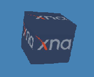

# Creating a Custom Vertex Declaration

Demonstrates how to create a custom vertex declaration and use it to render a 3D object.



Game Studio includes a few predefined classes for common vertex buffer declarations such as [VertexPositionColor](xref:Microsoft.Xna.Framework.Graphics.VertexPositionColor) and [VertexPositionColorTexture](xref:Microsoft.Xna.Framework.Graphics.VertexPositionColorTexture). If you need to create a vertex buffer declaration that includes additional user-defined types, create a custom vertex declaration.

A custom vertex declaration is a class that implements fully customizable per-vertex data. Furthermore, if you derive the class from [IVertexType](xref:Microsoft.Xna.Framework.Graphics.IVertexType), you will not need to create a vertex declaration when creating your vertex buffer or drawing the geometry.

## To create a custom vertex declaration

1. Declare a structure that derives from [IVertexType](xref:Microsoft.Xna.Framework.Graphics.IVertexType).

    ```csharp
    public struct CustomVertex1 : IVertexType
    ```

2. Add members to the struct that describe the per-vertex data.

    This example uses position as a [Vector3 Structure](xref:Microsoft.Xna.Framework.Vector3) type, a texture coordinate using a [Vector2 Structure](xref:Microsoft.Xna.Framework.Vector2) type, and a vertex declaration using the [VertexDeclaration](xref:Microsoft.Xna.Framework.Graphics.VertexDeclaration) type.

    ```csharp
    Vector3 vertexPosition;
    Vector2 vertexTextureCoordinate;
    
    public readonly static VertexDeclaration VertexDeclaration = new VertexDeclaration
    (
        new VertexElement(0, VertexElementFormat.Vector3, VertexElementUsage.Position, 0),
        new VertexElement(12, VertexElementFormat.Vector2, VertexElementUsage.TextureCoordinate, 0)
    );
    ```

3. Implement a constructor and public accessor methods.

    ```csharp
    //The constructor for the custom vertex. This allows similar 
    //initialization of custom vertex arrays as compared to arrays of a 
    //standard vertex type, such as VertexPositionColor.
    public CustomVertex1(Vector3 pos, Vector2 textureCoordinate)
    {
        vertexPosition = pos;
        vertexTextureCoordinate = textureCoordinate;
    }
    
    //Public methods for accessing the components of the custom vertex.
    public Vector3 Position
    {
        get { return vertexPosition; }
        set { vertexPosition = value; }
    }
    
    public Vector2 TextureCoordinate
    {
        get { return vertexTextureCoordinate; }
        set { vertexTextureCoordinate = value; }
    }
    ```

4. Implement a non-public method for accessing the vertex declaration.

    ```csharp
    VertexDeclaration IVertexType.VertexDeclaration
    {
        get { return VertexDeclaration; }
    }
    ```

5. Create a built-in effect to render the object with a texture using the [BasicEffect](xref:Microsoft.Xna.Framework.Graphics.BasicEffect) class as demonstrated in [Creating a Basic Effect](./HowTo_Create_a_BasicEffect.md).

6. Create the vertex buffer passing in the **typeof(CustomVertex1)** instead of a vertex declaration to describe the vertex buffer data.

    ```csharp
    vertexBuffer = new VertexBuffer(
        graphics.GraphicsDevice,
        typeof(CustomVertex1),
        number_of_vertices,
        BufferUsage.None
        );
    ```

7. Create the per-vertex data; this shows a portion of the code.

    ```csharp
    Vector3 LeftTopFront = new Vector3(-1.0f, 1.0f, 1.0f);
    Vector3 LeftBottomFront = new Vector3(-1.0f, -1.0f, 1.0f);
    Vector3 LeftTopBack = new Vector3(-1.0f, 1.0f, -1.0f);
    Vector3 LeftBottomBack = new Vector3(-1.0f, -1.0f, -1.0f);
    
    Vector3 RightTopFront = new Vector3(1.0f, 1.0f, 1.0f);
    Vector3 RightBottomFront = new Vector3(1.0f, -1.0f, 1.0f);
    Vector3 RightTopBack = new Vector3(1.0f, 1.0f, -1.0f);
    Vector3 RightBottomBack = new Vector3(1.0f, -1.0f, -1.0f);
    
    Vector2 textureLeftTop = new Vector2(0.0f, 0.0f);
    Vector2 textureLeftBottom = new Vector2(0.0f, 1.0f);
    Vector2 textureRightTop = new Vector2(1.0f, 0.0f);
    Vector2 textureRightBottom = new Vector2(1.0f, 1.0f);
    
    // Front face.
    cubeVertices[0] = new CustomVertex1(LeftTopFront, textureLeftTop);
    cubeVertices[1] = new CustomVertex1(LeftBottomFront, textureLeftBottom);
    cubeVertices[2] = new CustomVertex1(RightTopFront, textureRightTop);
    cubeVertices[3] = new CustomVertex1(LeftBottomFront, textureLeftBottom);
    cubeVertices[4] = new CustomVertex1(RightBottomFront, textureRightBottom);
    cubeVertices[5] = new CustomVertex1(RightTopFront, textureRightTop);
    ```

    > For a triangle list, you need three vertices for a triangle and two triangles to make the front face of a cube.

8. Set the data into the vertex buffer data by calling [VertexBuffer.SetData](xref:Microsoft.Xna.Framework.Graphics.VertexBuffer) and set the vertex buffer to the device by calling [GraphicsDevice.SetVertexBuffer](xref:Microsoft.Xna.Framework.Graphics.GraphicsDevice).

    ```csharp
    vertexBuffer.SetData<CustomVertex1>(cubeVertices);
    
    graphics.GraphicsDevice.SetVertexBuffer(vertexBuffer);
    ```

9. Draw the object by calling [GraphicsDevice.DrawPrimitives](xref:Microsoft.Xna.Framework.Graphics.GraphicsDevice).

    ```csharp
    RasterizerState rasterizerState1 = new RasterizerState();
    rasterizerState1.CullMode = CullMode.None;
    graphics.GraphicsDevice.RasterizerState = rasterizerState1;
    
    foreach (EffectPass pass in basicEffect.CurrentTechnique.Passes)
    {
        pass.Apply();
    
        graphics.GraphicsDevice.DrawPrimitives(
            PrimitiveType.TriangleList,
            0,  // start vertex
            12  // number of primitives to draw
        );
    }
    ```

© 2012 Microsoft Corporation. All rights reserved.  

© 2023 The MonoGame Foundation.
