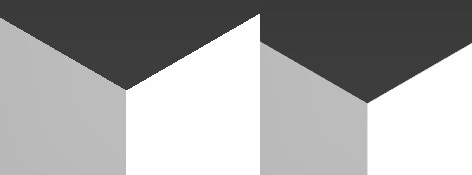

# Enabling Anti-aliasing (Multisampling)

Demonstrates how to enable anti-aliasing for your game.

**Figure 1.  Anti-aliasing the edges of a cube: multi-sampling is disabled on the left, and enabled on the right.**



Anti-aliasing is a technique for minimizing distortion artifacts caused by aliasing when rendering a high-resolution signal (such as a sharp edge) at a low resolution (such as in a render target with a fixed number of pixel locations). anti-aliasing smooths sharp edges by partially rendering to neighboring pixels. This technique is also called multi-sampling because each pixel value can be the result of multiple samples.

## Enabling Anti-aliasing

### To enable anti-aliasing in your game

* Render 3D geometry. One way to do this is by creating a BasicEffect using the [BasicEffect](xref:Microsoft.Xna.Framework.Graphics.BasicEffect) class. For more detail, see [Creating a Basic Effect](HowTo_Create_a_BasicEffect.md).

* Set [PreferMultiSampling](/api/Microsoft.Xna.Framework.GraphicsDeviceManager.html#Microsoft_Xna_Framework_GraphicsDeviceManager_PreferMultiSampling) to **true** in your [Game](xref:Microsoft.Xna.Framework.Game) class constructor.

    ```csharp
    graphics.PreferMultiSampling = true;
    ```

* Set the view matrix to place the camera close to the object so you can more clearly see the smoothed, anti-aliased edges.

    ```csharp
    worldMatrix = Matrix.CreateRotationX(tilt) * Matrix.CreateRotationY(tilt);
    
    viewMatrix = Matrix.CreateLookAt(new Vector3(1.75f, 1.75f, 1.75f), Vector3.Zero, Vector3.Up);
    
    projectionMatrix = Matrix.CreatePerspectiveFieldOfView(
        MathHelper.ToRadians(45),  // 45 degree angle
        (float)GraphicsDevice.Viewport.Width /
        (float)GraphicsDevice.Viewport.Height,
        1.0f, 100.0f);
    ```

* Draw the geometry by calling [GraphicsDevice.DrawPrimitives](/api/Microsoft.Xna.Framework.Graphics.GraphicsDevice.html#Microsoft_Xna_Framework_Graphics_GraphicsDevice_DrawPrimitives_Microsoft_Xna_Framework_Graphics_PrimitiveType_System_Int32_System_Int32_).

    ```csharp
    RasterizerState rasterizerState1 = new RasterizerState();
    rasterizerState1.CullMode = CullMode.None;
    graphics.GraphicsDevice.RasterizerState = rasterizerState1;
    foreach (EffectPass pass in basicEffect.CurrentTechnique.Passes)
    {
        pass.Apply();
    
        graphics.GraphicsDevice.DrawPrimitives(
            PrimitiveType.TriangleList,
            0,
            12
        );
    }
    ```

## See Also

### Concepts

[3D Pipeline Basics](../../whatis/graphics/WhatIs_3DRendering.md)  
[What Is anti-aliasing?](../../whatis/graphics/WhatIs_antialiasing.md)  

#### Reference

[GraphicsDeviceManager](xref:Microsoft.Xna.Framework.GraphicsDeviceManager)  
[PreparingDeviceSettings](/api/Microsoft.Xna.Framework.GraphicsDeviceManager.html#Microsoft_Xna_Framework_GraphicsDeviceManager_PreparingDeviceSettings)  
[PresentationParameters](xref:Microsoft.Xna.Framework.Graphics.PresentationParameters)  

---

© 2012 Microsoft Corporation. All rights reserved.  

© 2023 The MonoGame Foundation.
