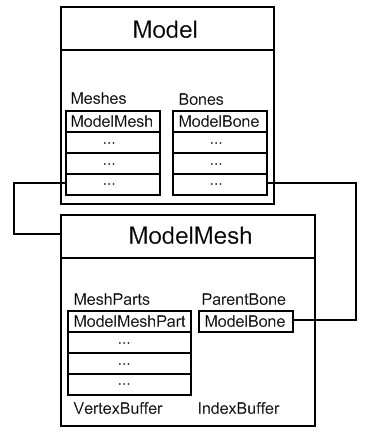

# What Is a Model Bone?

A model bone is a matrix that represents the position of a mesh as it relates to other meshes in a 3D model.

A complex computer-generated object, often called a model, is made up of many vertices and materials organized into a set of meshes. In the XNA Framework, a model is represented by the [Model](xref:Microsoft.Xna.Framework.Graphics.Model) class. A model contains one or more meshes, each of which is represented by a [ModelMesh](xref:Microsoft.Xna.Framework.Graphics.ModelMesh) class. Each mesh is associated with one bone represented by the [ModelBone](xref:Microsoft.Xna.Framework.Graphics.ModelBone) class.

The bone structure is set up to be hierarchical to make controlling each mesh (and therefore the entire model) easier. At the top of the hierarchy, the model has a [Root](xref:Microsoft.Xna.Framework.Graphics.Model.Root) bone to specify the overall position and orientation of the model. Each [ModelMesh](xref:Microsoft.Xna.Framework.Graphics.ModelMesh) object contains a [ParentBone](xref:Microsoft.Xna.Framework.Graphics.ModelMesh.ParentBone) and one or more [ModelBone](xref:Microsoft.Xna.Framework.Graphics.ModelBone). You can transform the entire model using the parent bone as well as transform each individual mesh with its bone. To animate one or more bones, update the bone transforms during the render loop by calling [Model.CopyAbsoluteBoneTransformsTo Method](/api/Microsoft.Xna.Framework.Graphics.Model.html#Microsoft_Xna_Framework_Graphics_Model_CopyAbsoluteBoneTransformsTo_Microsoft_Xna_Framework_Matrix___), which iterates the individual bone transforms to make them relative to the parent bone. To draw an entire model, loop through a mesh drawing each sub mesh.

---

© 2012 Microsoft Corporation. All rights reserved.  

© 2023 The MonoGame Foundation.
